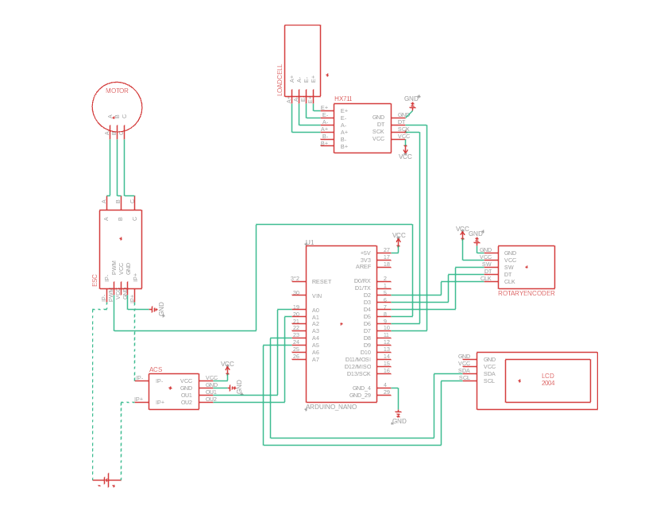

# MasterProps
A propeller testing rig to determine the properties of various fpv drone props.

## About
On the top it uses a AOS Supernova 2207 connected to an ESC. There is an Arduino board to controll the speed. The Arduino Nano is also connected to a hall sensor, a load cell and a diplay to show the measured data. Everything is powered by a 6S LiPo. The main goal of the rig is to determine the thrust of various 5 inch drone propellers and providing other data such as current to compare the different propellers. RPM and dB durrently have to be measured externally.

  
Schematic so far, the real one is still being built

## Features
The testing rig provides you with
- Current measurement (Ampere)
- Thrust value
- Your input speed - pwm value (manual or automatic test mode)
- (Voltage measurement can easily be added)
The measurements of the automatic mode can be exportet on to your PC to further analize them.

## BOM
- Arduino Nano R3
- LCD I2C 2004
- HX711 Loadcell
- ACS758 50A
- Rotary encoder
- Hobbywing SKYWALKER ESC 2 - 6s 60A
- Brushless Motor of your choice I'm using a AOS Supernovav 2207kv
- 6s LiPo Battery

## Assembly
Assemble the build according to the provided schematic. The mechanical layout of motor mounting point, loadcell position, etc. can be varied if wanted but make sure to calibrate the device with force measuring instruments.

## Safety
For a safe usage it's important to know what you are doing. Never go to near to the station or put your hand on it while tests are performed. While tests are being performed it is recommended stand behind the station looking from the propellers perspective or even build some safety walls in case of propellers breaking. Securely mount the station before performing any tests.
Tes the spinning diretion on low RPM after building and change the code to match your propeller type (cw or ccw).

